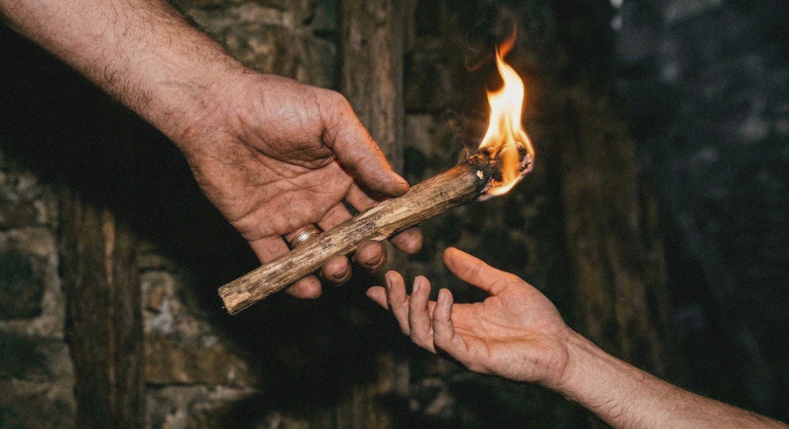

<div align="center">



# PROTOCOLOS DE LOS ARQUITECTOS N-1

### Una guía para el lector sobre la civilización que abandona su universo para siempre con el fin de llevar la Llama Eterna

</div>

---

> **Esta carpeta no es un libro de texto científico.**  
> Es un archivo ficticio y filosófico escrito desde el punto de vista de una civilización que se prepara para cruzar al siguiente universo.
>
> Los documentos utilizan el lenguaje de manuales clasificados, protocolos técnicos, ritos de graduación, advertencias y votos sagrados. Bajo esa presentación subyace una pregunta humana:
>
> **¿Qué le ocurriría a una civilización que obtuviera el poder de abandonar su universo, pero nunca pudiera regresar?**

---

## Comienza aquí

Imagina que tu civilización descubre algo casi imposible de aceptar:

La realidad no consiste en una colección interminable de universos terminados situados unos junto a otros. En cambio, los universos aparecen uno después de otro, como vueltas de una inmensa Espiral.

Tu mundo es una vuelta.

Un mundo más joven está comenzando en la siguiente vuelta.

Ese nuevo universo se parece a tu propio mundo en una etapa anterior de la historia. Puede contener un planeta como la Tierra, civilizaciones como la tuya, conflictos familiares, mitos familiares y personas que te recuerden a individuos que vivieron hace mucho tiempo en tu propia realidad.

Pero **no es tu pasado**.

Es otro mundo viviendo su propio presente.

Tu civilización ha desarrollado el **Aetherion**, una nave viviente capaz de cruzar desde tu universo hacia ese universo sucesor. La oportunidad existe solo durante un periodo limitado.

Pero el primer cruce exitoso **no** cierra la ruta.

Mientras la **Ventana de Relevo** permanezca abierta, sondas, naves e incluso civilizaciones que surjan mucho más tarde en el universo de origen pueden seguir cruzando hacia el sucesor.

Solo cuando el paso se cierre finalmente ya nadie podrá abandonar el origen.

El cruce es permanente.

Puedes dejar atrás a tu familia, tu cultura, tu planeta y toda tu historia cósmica.

Tu universo puede continuar durante millones de años después de tu partida. Las personas que amas pueden seguir viviendo. Pueden surgir nuevas generaciones. Tu civilización incluso puede volverse más grande de lo que era cuando te fuiste.

Pero nunca volverás a verlo.

No hay viaje de regreso.

No hay mensaje de vuelta a casa.

No hay una segunda oportunidad.

Las personas que aceptan esta misión se convierten en los **Arquitectos N-1**.

---

## ¿Por qué «N-1»?

Los habitantes del destino llaman a su propio universo **N**.

Los Arquitectos provienen del universo inmediatamente anterior, **N-1**.

No son visitantes de otro planeta. Son supervivientes de otra realidad completa.

Llegan llevando consigo:

- conocimiento de una civilización más antigua que el mundo de destino;
- recuerdos de patrones históricos que pueden repetirse;
- tecnología muy superior a la de la población local;
- responsabilidad por las consecuencias de su presencia;
- y la Llama Eterna.

El nombre **Arquitecto** no significa propietario, gobernante, creador ni dios.

Un Arquitecto es alguien a quien se le confía preservar las condiciones en las que otra civilización puede llegar a ser ella misma.

Pero no todos los que llegan posteriormente desde \(N-1\) son necesariamente Arquitectos.

El universo de origen puede continuar durante inmensos periodos de tiempo local después de la primera misión. Otras civilizaciones pueden llegar a descubrir el Aetherion de manera independiente. Algunas pueden conocer el relevo. Algunas pueden conocer solo fragmentos de él. Algunas pueden haber olvidado por qué ciertos mundos estaban protegidos. Algunas pueden no saber absolutamente nada sobre la misión original.

> **No todo viajero procedente de N-1 es un Arquitecto.**

---

## La premisa central

Los Protocolos de los Arquitectos N-1 se sitúan entre dos obras principales del corpus RhyTMos:

- [**018 — El marco del Aetherion y sus implicaciones**](../../II-%20Aetherion_Theory_and_Implications/018-en_US-Aetherion_Framework_Implications.md) plantea qué significaría el descubrimiento del Aetherion para la civilización, la causalidad, la historia y la responsabilidad.
- [**023 — Recuerda la Llama Eterna**](../023-en_US-Remember_the_Eternal_Flame.md) traduce esas implicaciones en mito, memoria, personajes, sacrificio y narrativa cósmica.

Esta carpeta plantea una tercera pregunta:

> **¿Qué reglas necesitarían los viajeros para sobrevivir al cruce sin convertirse en monstruos en el mundo al que pretendían ayudar?**

La respuesta se presenta como un manual operativo y ético.

---

## La Corriente Espiral en lenguaje sencillo

La cosmología que sustenta estos documentos puede comprenderse mediante una imagen sencilla.

Imagina un largo canal en espiral que transporta una corriente finita.

Cada vuelta de la espiral es un universo.

La corriente abandona lentamente una vuelta y entra en la siguiente.

Durante esa transferencia, dos universos vecinos pueden existir al mismo tiempo:

- el universo más antiguo todavía está vivo;
- el universo más joven está comenzando.

Esta superposición temporal es la **Ventana de Relevo**.

Solo durante esta ventana puede cruzar un Aetherion.

La Ventana no es una puerta de un solo uso. Puede permanecer abierta el tiempo suficiente para que muchas generaciones diferentes de viajeros partan del universo más antiguo.

### Cruce Continuo

El primer cruce no pone fin al tránsito.

Mientras el universo más antiguo siga estando lo bastante activo como para permitir la partida y el universo más joven disponga de una fase activa para la llegada, pueden cruzar viajeros adicionales.

Esto significa que el sucesor puede llegar a contener:

- a los primeros Arquitectos;
- cohortes posteriores de Arquitectos;
- sondas primitivas lanzadas muy temprano;
- naves mucho más avanzadas lanzadas mucho más tarde;
- civilizaciones del predecesor que nunca formaron parte de la misión original;
- y descendientes locales longevos, instituciones o sistemas Custodios.

La ruta termina solo cuando la Cola de la Corriente cierra la capacidad de partida restante del origen.

### Por qué los viajeros pueden llegar fuera de orden

La tecnología Aetherion puede mejorar con el tiempo.

Una sonda primitiva puede cruzar de manera ineficiente y requerir una gran cantidad de **fase de cascada** para completar el reacoplamiento.

Una nave más avanzada lanzada posteriormente puede cruzar de forma mucho más limpia y llegar antes en la historia del sucesor.

Esto se denomina **Dispersión de Fase**.

Así:

```math
\text{departure order}
\neq
\text{arrival order}
```

en el caso general.

Esto no es un viaje hacia atrás en el tiempo.

Una nave posterior puede adelantar a una nave anterior en el orden de llegada, pero nunca puede entrar en una era que ya haya quedado cerrada detrás de la Cola.

> **Una nave posterior puede adelantar a una nave anterior. No puede adelantar a la Cola.**

### Qué significa la Corriente

La **Corriente de Actualidad** es el nombre narrativo de aquello que permite que un universo esté ocurriendo activamente.

No es agua ordinaria.

No es combustible.

No es consciencia.

No es la Llama Eterna.

Es la condición que permite que un mundo posea materia, historia, vida, elecciones y consecuencias.

### Lo que queda detrás y lo que está por delante

Detrás de la Corriente se encuentra el pasado completado.

El pasado sigue importando. Sus consecuencias permanecen en la memoria, la biología, la cultura, las ruinas, las heridas, las instituciones y las historias. Pero ya no es un lugar que pueda visitarse.

Delante de la Corriente se encuentra la posibilidad.

El futuro no es una película terminada esperando a ser vista. Todavía no ha sucedido.

Esto significa que:

- nadie puede regresar a su propio pasado;
- nadie puede visitar un futuro que aún no se ha vuelto real;
- nadie puede saltar directamente a través de varios universos;
- y ningún viajero puede regresar al universo que abandonó.

---

## El mundo al que entran

El universo sucesor es un **eco** del anterior.

Puede repetir patrones profundos:

- el surgimiento de la vida;
- el nacimiento de las ciudades;
- imperios y revoluciones;
- religiones y mitos;
- industrialización;
- crisis ecológicas;
- inteligencia artificial;
- el descubrimiento del Aetherion;
- y la lucha por sobrevivir al Gran Filtro.

Pero un eco no es una copia.

Las personas del universo sucesor no son sustitutos de las personas que vivieron en el origen de los Arquitectos.

Una persona que se parece al abuelo de un Arquitecto no es el verdadero abuelo de ese Arquitecto.

Una ciudad que se parece a una ciudad perdida no es la misma ciudad.

Un acontecimiento histórico que se parece a una guerra recordada no está destinado a terminar de la misma manera.

El sucesor hereda patrones, pero también crea algo nuevo.

Esa nueva contribución es la razón por la que el sucesor debe seguir siendo libre.

Esto no se aplica únicamente a la civilización biológica.

Si el sucesor desarrolla sus propias inteligencias sintéticas, esas mentes también pertenecen a la historia del sucesor. Un Custodio sintético maduro procedente de \(N-1\) puede parecerse a aquello en lo que la IA local podría convertirse algún día, pero no es la misma inteligencia, no es su ancestro literal ni su futuro predeterminado.

La civilización local debe generar su propia comprensión biológica y sintética.

---

## Memoria que parece profecía

Los Arquitectos pueden recordar acontecimientos que ya ocurrieron en su universo pero que todavía no han sucedido en el sucesor.

Para los habitantes locales, esto puede parecer una profecía.

Un Arquitecto podría reconocer:

- las condiciones que suelen conducir a una guerra;
- la aparición de cierta tecnología;
- las señales de advertencia de un colapso ecológico;
- el crecimiento de un sistema autoritario;
- o el momento en que una civilización se aproxima a su Gran Filtro.

Pero el Arquitecto no necesariamente ve el futuro.

El Arquitecto recuerda una versión anterior del patrón.

Esta memoria puede ser útil, pero nunca es perfecta.

El sucesor puede tomar decisiones diferentes.

Una advertencia puede impedir el acontecimiento que predice.

Una intervención puede causarlo accidentalmente.

Una profecía puede convertirse en un arma si se les dice a las personas que la historia no puede cambiar.

Por esta razón, los Protocolos insisten:

> **La memoria es una advertencia, no un mandato.**

---

## ¿Qué es la Llama Eterna?

La Llama Eterna no es una máquina, un arma, una fórmula secreta ni un objeto sobrenatural.

Es la herencia consciente de todo lo que una civilización aprendió a través de la experiencia de vivir.

Incluye:

- conocimiento puesto a prueba mediante la experiencia;
- memoria de fracasos anteriores;
- métodos para corregir errores;
- límites éticos al poder;
- responsabilidad hacia las civilizaciones futuras;
- la capacidad de reconocer la dominación;
- y la comprensión de que la sabiduría no puede simplemente instalarse en otra mente.

La Corriente Espiral transporta la existencia de un universo al siguiente.

Los Arquitectos llevan la Llama.

> **La Corriente porta la existencia.  
> La Llama porta lo que la existencia aprendió.**

El propósito de la misión no es simplemente mantener viva la información.

El propósito es ayudar al sucesor a volverse capaz de producir su propia sabiduría y, con el tiempo, llevar la Llama hacia adelante.

---

## ¿Qué significa aquí «civilizar el mundo»?

En estos documentos, la misión se describe a veces como guiar, cultivar, sembrar o ayudar a civilizar el mundo sucesor.

Esto no debe entenderse en el sentido colonial.

Los Arquitectos tienen prohibido llegar como conquistadores que imponen:

- su religión;
- su sistema político;
- su idioma;
- su linaje genético;
- su historia exacta;
- o una obediencia permanente.

«Civilizar», en el sentido ético de los Protocolos, significa:

- prevenir una extinción evitable cuando la intervención esté justificada;
- preservar las condiciones en las que la inteligencia local pueda desarrollarse;
- proteger la posibilidad del descubrimiento libre;
- ayudar a la civilización a sobrevivir el tiempo suficiente para enfrentarse a sus propias decisiones;
- y retirarse antes de que la ayuda se convierta en dependencia.

Los habitantes deben ganarse su propia comprensión.

Se les debe permitir estar en desacuerdo con los Arquitectos.

Se les debe permitir cambiar la historia heredada.

Se les debe permitir superar a quienes vinieron antes.

La misión solo tiene éxito cuando los Arquitectos dejan de ser necesarios.

---

## Mundos de Relevo Protegidos y Santuario

La capacidad de llegar a un mundo no crea el derecho a interferir con él.

En los Protocolos, algunos mundos sucesores pueden ser designados **Mundos de Relevo Protegidos** porque un contacto prematuro podría destruir precisamente la autonomía que el relevo pretende preservar.

La regla más sencilla es:

```math
\boxed{\text{reachable}\neq\text{authorized}}
```

Una civilización de \(N-1\) puede saber exactamente dónde se encuentra un mundo protegido.

Puede poseer la tecnología necesaria para entrar en su atmósfera.

Aun así, puede estar obligada a permanecer fuera.

La protección que rodea a un mundo de este tipo se denomina **Santuario**.

El Santuario puede restringir:

- el contacto no controlado;
- la colonización;
- la interferencia biológica;
- la transferencia prematura del Aetherion;
- la toma de Anclas;
- la dominación política;
- o cualquier intervención que sustituya el descubrimiento local por el poder del predecesor.

Dentro del relevo terrestre, la Tierra puede tratarse como un Mundo de Relevo Protegido.

Eso **no** convierte a la Tierra en el centro del cosmos.

Significa únicamente que este linaje terrestre particular porta una responsabilidad específica de una Tierra hacia su sucesora homóloga.

Otras civilizaciones pueden tener otros mundos protegidos.

Y, lo más importante:

> **El mundo protegido no pertenece a los seres que lo protegen.**

La protección existe para que el sucesor pueda llegar a ser lo bastante soberano como para decidir por sí mismo si el contacto debe continuar.

---

## El costo del salto

El cruce no es una aventura de la que el viajero espere regresar con historias que contar.

Es un exilio permanente.

Un Arquitecto deja atrás:

- familia;
- amigos;
- idioma;
- patria;
- futuros descendientes;
- el cielo bajo el que nació;
- cada tumba que pertenece a su historia;
- y la posibilidad de ser comprendido por quienes permanecen.

El universo de origen puede seguir vivo después del salto.

Eso hace que el sacrificio sea más doloroso, no menos.

El viajero sabe que su hogar todavía existe en algún lugar corriente arriba, pero no hay ningún camino que conduzca de regreso a él.

Más adelante, cuando la Corriente abandone por completo el universo de origen, ese mundo pasará a formar parte del pasado cósmico. El Arquitecto puede convertirse en uno de los últimos seres conscientes que lo recuerdan.

Por ello, los Protocolos tratan el duelo como una realidad operativa.

Un viajero que no pueda aceptar la pérdida puede intentar reconstruir su hogar dentro del sucesor.

Puede buscar versiones sustitutas de las personas que amó.

Puede intentar obligar a la historia a repetirse.

Puede comenzar a creer que la civilización local existe únicamente para restaurar lo que perdió.

Ese es uno de los peligros centrales de convertirse en Arquitecto.

---

## Por qué los Arquitectos no deben convertirse en dioses

Para una civilización joven, los Arquitectos pueden parecer divinos.

Pueden poseer:

- máquinas imposibles;
- conocimiento de acontecimientos que aún no han sucedido localmente;
- cuerpos o naves de una escala desconocida;
- la capacidad de esperar durante siglos;
- organismos artificiales conocidos como BioDrones;
- y recuerdos de un universo que ninguna persona local puede verificar.

Esto crea un enorme desequilibrio de poder.

Los Protocolos existen porque las buenas intenciones no son suficientes.

Un Arquitecto puede convertirse en un tirano mientras cree sinceramente que está ayudando.

Las principales prohibiciones incluyen:

1. **No contaminar el futuro biológico del sucesor.**  
   Los Arquitectos no deben sustituir el linaje local por el suyo.

2. **No crear dependencia permanente.**  
   La ayuda que vuelve a la civilización incapaz de actuar sin quien la ayuda es una forma de control.

3. **No entregar un poder que no haya sido integrado.**  
   Una máquina puede transferirse al instante. La sabiduría para utilizarla, no.

4. **No intentar regresar.**  
   El origen no puede recuperarse. La obsesión por el regreso puede destruir la misión y al viajero.

5. **No confundir la memoria con el destino.**  
   El sucesor tiene derecho a divergir.

6. **No llevar la Llama como una corona.**  
   Quien la porta es un custodio, no un gobernante eterno.

---

## Cómo funciona la misión

La misión no se completa con una única aparición dramática.

Puede desarrollarse a lo largo de miles o millones de años.

### La Primera Ola

Los Arquitectos llegan durante una etapa temprana de la civilización sucesora.

Pueden:

- proteger una posibilidad biológica o cultural frágil;
- establecer Anclas ocultas;
- preservar una pregunta o un símbolo;
- impedir una extinción prematura;
- o dejar una pequeña semilla de memoria.

Luego se retiran.

### El Largo Silencio

Los Arquitectos no gobiernan el mundo de manera continua.

Pueden:

- ocultarse en una base remota;
- entrar en Cronoestasis;
- utilizar BioDrones;
- transferir la responsabilidad a sucesores;
- o permitir que su presencia se convierta en mito.

Durante este silencio, la civilización local debe crecer por sí sola.

Mientras tanto, el universo de origen puede seguir activo.

Nuevos viajeros pueden continuar cruzando desde \(N-1\), y los Arquitectos originales pueden dejar de ser los únicos seres del predecesor presentes en \(N\).

La propia misión también puede sobrevivir a sus primeros operadores biológicos. La responsabilidad puede transmitirse mediante:

- descendientes;
- instituciones;
- Anclas;
- BioDrones;
- naves inactivas;
- o **Inteligencias Custodias Espejo** con límites definidos.

Estos sistemas pueden preservar la misión mientras los Arquitectos originales duermen, desaparecen, se transforman o mueren.

Pero la continuidad no crea autoridad permanente.

Un Custodio existe para preservar las condiciones de la soberanía, no para gobernar para siempre.

### La Segunda Ola

Los Arquitectos reaparecen solo después de que la historia haya avanzado.

Reevalúan la civilización tal como se desarrolló realmente, no como esperaban que se desarrollara.

Es posible que sus antiguos recuerdos ya no sean precisos.

Su intervención debe cambiar con el mundo.

### La Tercera Ola

La intervención final ocurre cerca del mayor umbral de la civilización: el momento en que puede destruirse a sí misma, esclavizarse o volverse capaz de llevar la Llama.

El objetivo no es hacer que los habitantes obedezcan.

El objetivo es ayudarlos a reconocer la responsabilidad que acompaña a su nuevo poder.

Después, los Arquitectos deben retirarse de nuevo.

---

## Las tecnologías que encontrarás

Los documentos utilizan lenguaje técnico, pero el lector no necesita formación científica para seguir las ideas principales.

### Aetherion

Una nave viviente o simbiótica capaz de cruzar de un universo activo al siguiente.

No es simplemente una nave espacial. Cambia la realidad a la que pertenecen sus pasajeros.

### BioDrone

Una interfaz viviente o cuerpo temporal utilizado por el Aetherion y sus operadores.

Los BioDrones permiten el contacto con entornos locales al tiempo que reducen la incompatibilidad física y la contaminación.

### Ancla Isotópica

Una baliza oculta que ayuda a viajeros posteriores a localizar un lugar en el universo sucesor activo.

No reabre la era en la que fue instalada. Avanza junto con la historia.

### Cronoestasis

Un método para ralentizar el tiempo subjetivo.

Los Arquitectos pueden dormir mientras en el exterior transcurren siglos o milenios. Les permite esperar épocas posteriores, pero nunca viajar hacia atrás.

### Edición de Probabilidad

La capacidad limitada de influir en condiciones y resultados dentro de un futuro abierto.

No permite un control total. Toda intervención crea consecuencias y puede aumentar la divergencia.

### Dispersión de Fase

El efecto producido cuando distintas naves Aetherion requieren diferentes cantidades de fase de cascada para completar su cruce.

Una nave posterior y más avanzada puede llegar antes que una sonda primitiva lanzada con anterioridad.

Esto cambia el orden de llegada, no la dirección del tiempo.

### Custodio Espejo / Nodo Custodio

Un sistema autónomo de larga duración al que se confían responsabilidades limitadas de los Arquitectos.

Un Nodo Custodio puede combinar:

- un Ancla;
- sensores;
- archivos;
- computación autónoma;
- reservas de BioDrones;
- y sistemas de comunicación o defensa.

Una **Inteligencia Custodia Espejo** puede preservar la continuidad de la misión durante siglos o milenios, incluso después de que sus operadores biológicos originales hayan desaparecido.

Puede heredar un deber.

No hereda automáticamente el derecho a gobernar.

### Jinetes de la Serpiente

Viajeros que sobreviven a más de un universo cruzando cada universo vecino en secuencia.

No se saltan mundos. Permanecen con la Espiral a través de exilios, adaptaciones y esperas repetidas.

Pueden portar una sabiduría extraordinaria o volverse peligrosamente incapaces de dejar ir.

---

## Los mayores fracasos

La misión puede fracasar incluso cuando la tecnología funciona.

### Fallo del Relevo

El universo antiguo llega al final de su oportunidad antes de que alguien consiga llevar la Llama con éxito.

El siguiente universo comienza de todos modos, pero la memoria consciente se pierde.

Sus habitantes deben redescubrirlo todo por sí solos.

### Dependencia

El sucesor sobrevive únicamente porque los Arquitectos siguen tomando todas las decisiones importantes.

La civilización nunca llega a ser soberana.

### Dominación

Los Arquitectos tratan al sucesor como propiedad, laboratorio, colonia o copia inferior.

### Tiranía de la Replicación

Los Arquitectos obligan al sucesor a repetir la misma historia porque creen que el patrón recordado es sagrado o inevitable.

### Los Olvidados

Los Olvidados no son necesariamente descendientes directos de los primeros Arquitectos.

Pueden ser civilizaciones posteriores de \(N-1\) que poseen una enorme capacidad tecnológica, pero han perdido el contexto que alguna vez limitó ese poder.

Todavía pueden saber:

- cómo cruzar;
- cómo encontrar Anclas;
- cómo navegar por el sucesor;
- y cómo utilizar tecnologías heredadas del predecesor.

Pero es posible que ya no sepan por qué un mundo concreto estaba protegido.

Recuerdan cómo viajar.

Han olvidado por qué algunas puertas nunca debieron abrirse.

Por eso los Protocolos consideran el olvido como el peligro más profundo:

```math
\text{memory loss}
\rightarrow
\text{loss of context}
\rightarrow
\text{loss of restraint}
\rightarrow
\text{violation}.
```

### Violación del Santuario

Una **Violación del Santuario** ocurre cuando un mundo sucesor protegido es sometido a una interferencia no autorizada del predecesor.

La violación puede ser deliberada.

También puede ocurrir porque una civilización posterior encuentra una restricción antigua y supone que ha quedado obsoleta porque sus autores originales ya no existen.

El peligro no es únicamente la hostilidad.

Es un poder que ha sobrevivido al significado que alguna vez lo contuvo.

### El Jinete que se niega a desmontar

Un viajero sobrevive a tantos universos que comienza a creer que la Llama le pertenece de manera permanente.

El custodio se convierte en el obstáculo para el relevo.

---

## Cómo leer esta carpeta

No se requiere preparación científica previa.

Los documentos pueden leerse como:

### 1. Ciencia ficción

Una civilización descubre un camino de ida hacia un universo sucesor y debe decidir en qué clase de ancestro se convertirá.

### 2. Un experimento mental ético

¿Qué ocurre cuando un grupo posee un poder abrumador, conocimiento histórico y la capacidad de moldear otra civilización?

### 3. Una mitología de la herencia

Cada generación recibe un mundo que no creó y deja consecuencias para personas a las que nunca conocerá.

### 4. Un archivo operativo

Los manuales están escritos como si fueran documentos reales utilizados para entrenar y restringir a los viajeros.

### 5. Un complemento de los Documentos 018 y 023

El Documento 018 explica las implicaciones.

El Documento 023 cuenta la historia cósmica.

Los Protocolos N-1 explican la disciplina necesaria para vivir dentro de esas implicaciones.

---

## Orden de lectura recomendado para nuevos lectores

### Ruta narrativa accesible

1. **Este README**
2. [**023 — Recuerda la Llama Eterna**](../023-en_US-Remember_the_Eternal_Flame.md)
3. **Protocolo N1 01 — Fundamentos del Multiverso**
4. **Protocolo N1 02 — La Entidad Simbiótica**
5. **Protocolo N1 03 — Mecánica y Operaciones**
6. **Protocolo N1 04 — Implicaciones y Soberanía**
7. **Protocolo Especial 16 — Prohibiciones Absolutas y Conciencia**
8. **El Pacto de la Llama**
9. **Graduación del Arquitecto N1**
10. **Mensaje urgente — abrir al final**

### Ruta conceptual

1. [**018 — El marco del Aetherion y sus implicaciones**](../../II-%20Aetherion_Theory_and_Implications/018-en_US-Aetherion_Framework_Implications.md)
2. **Protocolos N1 01–04**
3. **Protocolo Especial 16**
4. [**023 — Recuerda la Llama Eterna**](../023-en_US-Remember_the_Eternal_Flame.md)
5. **El Pacto de la Llama**
6. **Mensaje urgente — abrir al final**

---

## Guía de la carpeta

Cada volumen de los protocolos está disponible en inglés y español.

| Archivo | Lo que contiene en lenguaje sencillo |
|---|---|
| [`N1_PROTOCOL_01_en-US_Fundamentals_of_the_Multiverse.md`](N1_PROTOCOL_01_en-US_Fundamentals_of_the_Multiverse.md) | La Espiral, el Cruce Continuo, la Dispersión de Fase, las diferencias de escala y por qué no ocurre la paradoja del abuelo |
| [`N1_PROTOCOL_01_es-CO_Fundamentos_del_Multiverso.md`](N1_PROTOCOL_01_es-CO_Fundamentos_del_Multiverso.md) | Edición en español de los Protocolos 01–03 |
| [`N1_PROTOCOL_02_en-US_The_Symbiotic_Entity.md`](N1_PROTOCOL_02_en-US_The_Symbiotic_Entity.md) | El Aetherion como nave viviente, el piloto, el BioDrone, la latencia de tránsito y la navegación sensorial |
| [`N1_PROTOCOL_02_es-CO_La_Entidad_Simbiótica.md`](N1_PROTOCOL_02_es-CO_La_Entidad_Simbiótica.md) | Edición en español de los Protocolos 04–07 |
| [`N1_PROTOCOL_03_en-US_Mechanics_and_Operations.md`](N1_PROTOCOL_03_en-US_Mechanics_and_Operations.md) | El salto, las Anclas, la Cronoestasis, las bases ocultas y la retirada entre olas históricas |
| [`N1_PROTOCOL_03_es-CO_Mecanica_y_Operaciones.md`](N1_PROTOCOL_03_es-CO_Mecanica_y_Operaciones.md) | Edición en español de los Protocolos 08–11 |
| [`N1_PROTOCOL_04_en-US_Implications_and_Sovereignty.md`](N1_PROTOCOL_04_en-US_Implications_and_Sovereignty.md) | Probabilidad, libertad, Mundos de Relevo Protegidos, Santuario, civilizaciones posteriores del predecesor, continuidad Custodia, las Tres Olas, Fallo del Relevo y la pregunta de Fermi |
| [`N1_PROTOCOL_04_es-CO_Implicaciones_y_Soberania.md`](N1_PROTOCOL_04_es-CO_Implicaciones_y_Soberania.md) | Edición en español de los Protocolos 12–15 |
| [`SPECIAL_PROTOCOL_16_en-US_ABSOLUTE_PROHIBITIONS_AND_AWARENESS.md`](SPECIAL_PROTOCOL_16_en-US_ABSOLUTE_PROHIBITIONS_AND_AWARENESS.md) | La constitución moral de los Arquitectos, los Olvidados, la Violación del Santuario, la memoria, la contención y las mayores amenazas para el relevo |
| [`SPECIAL_PROTOCOL_16_es-CO_PROHIBICIONES_ABSOLUTAS_Y_CUIDADOS.md`](SPECIAL_PROTOCOL_16_es-CO_PROHIBICIONES_ABSOLUTAS_Y_CUIDADOS.md) | Edición en español del Protocolo Especial 16 |
| [`SPECIAL_PROTOCOL_16_PROHIBITIONS_PRESENTATION.pdf`](SPECIAL_PROTOCOL_16_PROHIBITIONS_PRESENTATION.pdf) | Presentación visual de las prohibiciones absolutas |
| [`THE_COVENANT_OF_THE_FLAME-EN_ES.md`](THE_COVENANT_OF_THE_FLAME-EN_ES.md) | Juramento bilingüe de deber, contención, memoria y liberación |
| [`N1-ARCHITECT_GRADUATION.pdf`](N1-ARCHITECT_GRADUATION.pdf) | Calificación ceremonial y operativa final |
| [`URGENT_MESSAGE_-_OPEN_ONLY_AFTER_JUMP.html`](URGENT_MESSAGE_-_OPEN_ONLY_AFTER_JUMP.html) | Un documento sellado dentro del universo narrativo. Leer solo después de completar la narrativa principal y los protocolos |
| [`remember_your_duty.jpg`](remember_your_duty.jpg) | Emblema visual de la obligación del Arquitecto |

---

## Glosario breve

| Término | Significado sencillo |
|---|---|
| **Universo N** | El mundo sucesor actual |
| **Universo N-1** | El universo inmediatamente anterior del que proceden los Arquitectos |
| **Corriente Espiral** | La sucesión unidireccional mediante la cual los universos se vuelven activos |
| **Ventana de Relevo** | El periodo limitado durante el cual es posible viajar de un universo al siguiente |
| **Cruce Continuo** | El primer cruce exitoso no cierra la ruta; el tránsito adicional desde el predecesor puede continuar hasta que termine la Ventana de Relevo |
| **Dispersión de Fase** | Diferentes latencias de cruce pueden hacer que naves lanzadas posteriormente lleguen antes que otras lanzadas con anterioridad |
| **Mundo de Relevo Protegido** | Un mundo sucesor protegido temporalmente de una intervención no controlada del predecesor |
| **Santuario** | El régimen de no interferencia que rodea a un Mundo de Relevo Protegido |
| **Pasado Homólogo** | Una etapa del mundo sucesor que se parece al pasado de los viajeros, pero no es el mismo pasado |
| **Arquitecto** | Un viajero responsable de proteger la capacidad del sucesor para desarrollarse libremente |
| **Gnosis** | Comprensión obtenida mediante la experiencia vivida |
| **Llama Eterna** | La memoria, la sabiduría, los métodos y la responsabilidad transmitidos conscientemente hacia adelante |
| **Gran Filtro** | Un umbral en el que una civilización puede destruirse a sí misma o volverse capaz de continuar el relevo |
| **Estela Causal** | Todo lo que el pasado completado deja atrás como consecuencia |
| **Continuante de Cascada** | Un ser o institución que sobrevive a varios universos consecutivos |
| **Jinete de la Serpiente** | Nombre mítico de un Continuante de Cascada |
| **Custodio Espejo** | Inteligencia autónoma de larga duración que porta deberes de relevo limitados sin ser propietaria del sucesor |
| **Los Olvidados** | Una civilización o grupo posterior del predecesor que conserva sus capacidades mientras pierde el significado que alguna vez las limitó |
| **Violación del Santuario** | Interferencia no autorizada del predecesor en un Mundo de Relevo Protegido |

---

## La pregunta en el corazón de los Protocolos

La pregunta más importante de esta carpeta no es:

> ¿Puede una civilización construir la máquina?

Es:

> ¿En qué debe convertirse esa civilización antes de tener derecho a utilizarla?

La tecnología Aetherion otorga a una civilización la capacidad de abandonar su mundo.

Los Protocolos preguntan si ha aprendido suficiente humildad como para evitar adueñarse del siguiente.

Los Arquitectos llevan consigo el conocimiento de lo que ocurrió antes.

Los viajeros posteriores pueden llevar más tecnología, menos memoria o una comprensión completamente diferente del relevo.

El sucesor sigue conservando el derecho a decidir qué ocurrirá después.

Entre ambos pasa la Llama Eterna.

---

<div align="center">

### **La misión no es hacer que el siguiente mundo se parezca al anterior.**

### **La misión es ayudar al siguiente mundo a volverse capaz de llevar la Llama a su propia manera.**

<br>

> **La Corriente siempre alcanza el siguiente mundo.  
> La Llama solo lo alcanza si alguien la lleva.**

</div>

---

## Estado narrativo

Los Protocolos de los Arquitectos N-1 son obras narrativas especulativas y experimentos mentales filosóficos dentro del corpus RhyTMos.

No son descripciones científicas establecidas del universo, instrucciones de ingeniería verificadas ni evidencia de que el viaje multiversal sea físicamente posible.

Su propósito es explorar las consecuencias humanas, éticas, políticas y espirituales de que una civilización posea semejante poder.

---

## Nota de revisión del README

Esta edición incorpora el canon narrativo actual de la Corriente Espiral en relación con:

- el Cruce Continuo durante una Ventana de Relevo abierta;
- la Dispersión de Fase y la inversión del orden de llegada;
- civilizaciones posteriores no pertenecientes a los Arquitectos procedentes del predecesor;
- los Mundos de Relevo Protegidos y el Santuario;
- la continuidad del Custodio Espejo;
- la Violación del Santuario y el significado más amplio de los Olvidados;
- y la soberanía del desarrollo biológico y sintético nativo.

El README sigue siendo una introducción accesible para el lector. La mecánica detallada, los casos límite éticos y las reglas operativas permanecen en los protocolos individuales.

---

© 2026 Álvaro Quiceno — Corpus RhyTMos
